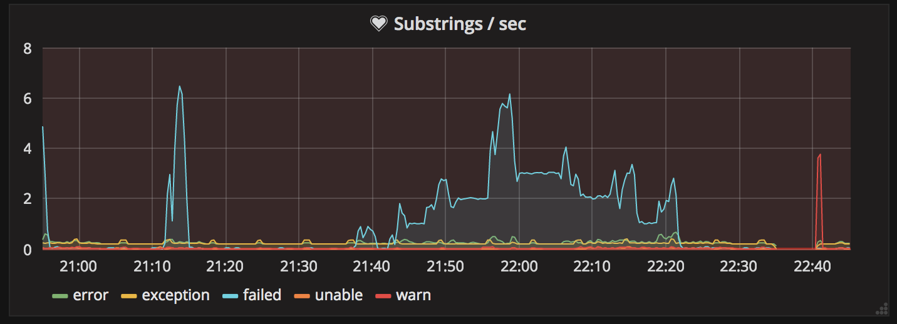

# fluentd-prometheus-grep-example

This repo provides files to construct a simple solution to the common problem of wanting to have vision on the stream of log messages passing through fluentd.  It is not, in itself, a working solution.

It makes use of https://github.com/fluent/fluent-plugin-prometheus to publish prometheus metrics and a simple custom plugin `filter_substringcounter.rb` to count substrings in incoming text messages.

Simple configuration to watch for certain substrings:

```
<filter>
    @type substringcounter

    substrings exception,error,failed,unable,warn
</filter>
```

The matching prometheus config is unfortunately very verbose:

```
<filter **>
    @type prometheus
    <metric>
    name fluentd_substring_exception_total
    type counter
    desc The total number of exception substrings in message.
    key exception
    </metric>
    <metric>
    name fluentd_substring_warn_total
    type counter
    desc The total number of warn substrings in message.
    key warn
    </metric>    
    ...
</filter>
```

Unfortunately, as far as I can tell, there is no way to do something clever like:

```
<filter **>
    @type prometheus
    <metric>
    name fluentd_substring_${key}_total
    type counter
    desc The total number of ${key} substrings in message.
    key warn
    </metric>  
</filter>
```

## Metrics

With this setup you will publish prometheus counters for each substring and a summary to track the total processing time incurred by adding the substringcounter filter.  This will allow you to generate graphs and alerts using a visualization package like Grafana.



## Fair Warning

I am not a Fluentd, Ruby or Prometheus expert.  Any advice is welcome and encouraged.  This was a simple solution I patched together in a weekend to give better visibility on Kubernetes cluster logs during offloading.  If you need to do serious log analysis and aggegration there are paid services like Splunk or you can try running your own Elasticsearch cluster. 